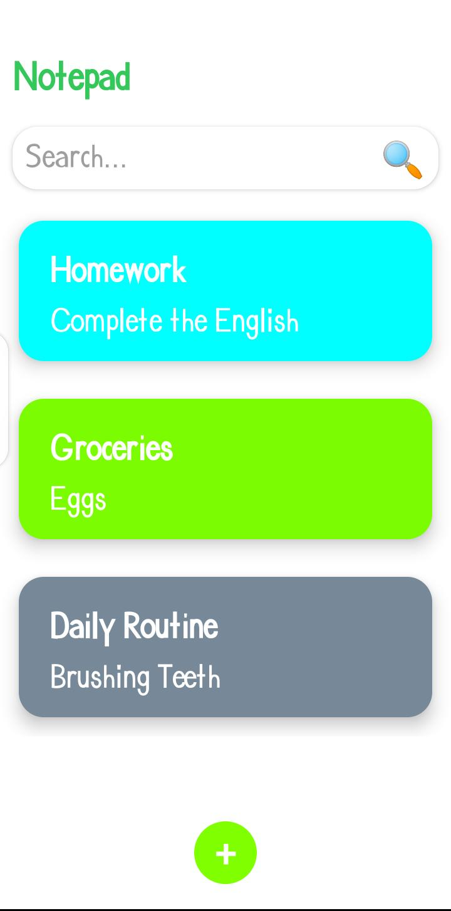

# 📒 Notepad App

A simple and efficient Notepad app built using React Native, allowing users to add, update, delete, and search their notes. All notes are stored locally using Async-Storage, ensuring your notes are always accessible, even offline.

## 🚀 Features

- **Add Notes:** Create new notes quickly and easily.
- **Update Notes:** Edit your existing notes with ease.
- **Delete Notes:** Remove notes that are no longer needed.
- **Search Functionality:** Quickly find notes by searching through your saved notes.
- **Persistent Storage:** All notes are saved locally using Async-Storage, ensuring data persists even after the app is closed.

## 🛠️ Built With

- **React Native** - Cross-platform mobile app development
- **React Navigation** - Smooth and seamless navigation
- **Redux Toolkit** - Efficient and scalable state management
- **Redux Persist** - Persistent Redux state across app sessions
- **Async-Storage** - Local storage for saving user notes
- **Moment** - Date and time manipulation made easy

## 📦 Installation

1. **Clone the repository:**
   ```bash
   git clone https://github.com/muhammad-dayyan-dev/notepad.git
   cd notepad-app
   ```

2. **Install the dependencies:**
   ```bash
   npm install
   # or
   yarn install
   ```

3. **Run the app:**
   ```bash
   npm run android
   # or
   npm run ios
   ```

## 📸 Screenshots




## 🙌 Acknowledgments

- Thanks to the creators and maintainers of the packages used in this project.
- Inspired by the need for a simple yet functional notepad app.